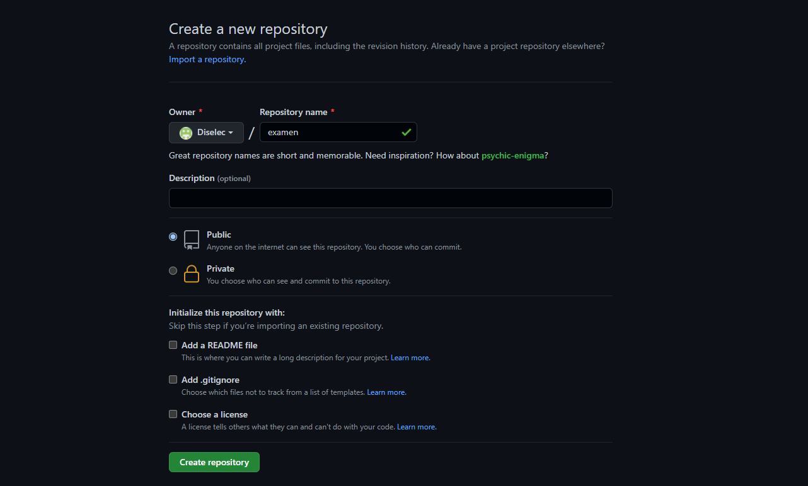
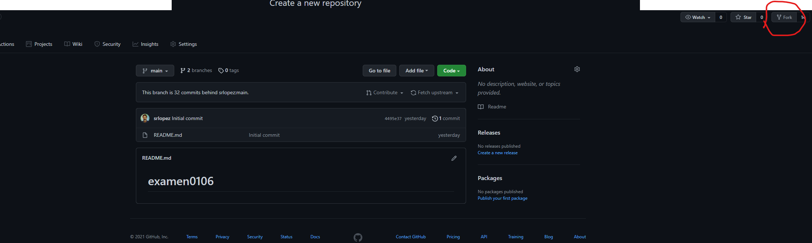
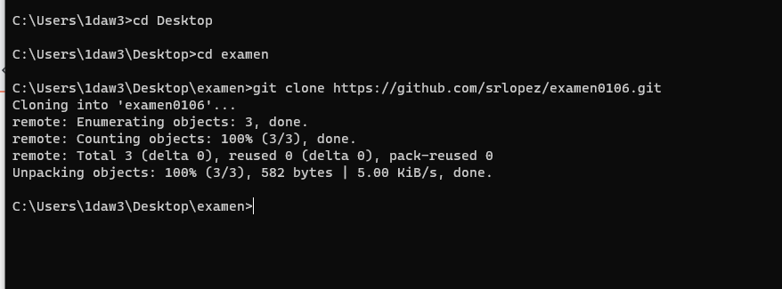

#Examen

##En Github:
*Crear repositorio*

*Crear un fork*

##De Github a local:
Para descargar el repositorio que queremos, tenemos que usar el comando git clone:

*Git clone*

*Crear una issue*

*Crear una rama*

*Confirmar los cambios*

